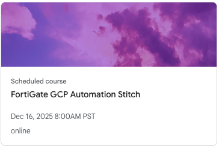

|                            |    |  
|----------------------------| ----
| **Goal**                   | Log into Qwiklab
| **Task**                   | Create account and login
| **Verify task completion** | You should see lab card available on your home page

## ***Navigate to Qwiklab - estimated duration 5 min***

Qwiklabs is Fortinet's hands-on learning platform that provides temporary, isolated cloud environments for technical training and certification labs. It automatically provisions dedicated Google Cloud Platform projects with pre-configured resources, allowing students to practice with real cloud infrastructure without affecting production environments or incurring personal costs.

If you already have an account, click this [Qwiklabs sign in](https://fortinet.qwiklabs.com/users/sign_in) link.  Please use same email address that you used to register for this course.  You will see a link to the lab session on your Dashboard.  

If you do not have an account, click on this [Qwiklabs sign up](https://fortinet.qwiklabs.com/users/sign_up) link and create one using the same email that you used to register for this course.  Once completed, you will recieve an email to verify the account.

### Go To Lab

Once you have verified your account, log in and you will see a link to the lab session on your Dashboard that looks something like below:
**Click on it to begin**

