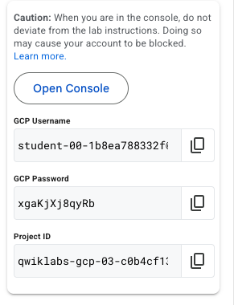

|                            |    |  
|----------------------------| ----
| **Goal**                   | Connect to GCP Console
| **Task**                   | Open GCP Console in Incognito browser window
| **Verify task completion** | You should see the resources configured in the lab environment

## Open Console

When your lab is fully provisioned, you will seee a list of student resources on the left panel.  This screen should be left up for the duration of the lab.  If you close it by accident, you can re-open it by clicking on the lab session again See "CH1: Setup".   It is probably a good idea to copy and paste these values into your text editor for safe keeping.

- Right lick on **Open Console** and choose **Open Link in Incognito Window**

- This should populate your GCP student username into the "Email or phone" block.  If not, return to the student resources pane and copy the GCP username and paste it in.
- Click **Next**
- Copy the GCP password from the student resources pane and paste it into the "Enter your password" section.
- Click **Next**
- Click **I understand** on the Welcome page.
- This will take you to the Console Dashboard, but you have to agree to the terms of service by clicking the box and then clicking **AGREE AND CONTINUE**

### This chapter is complete!  Congratulations.  You can move to the next Chapter